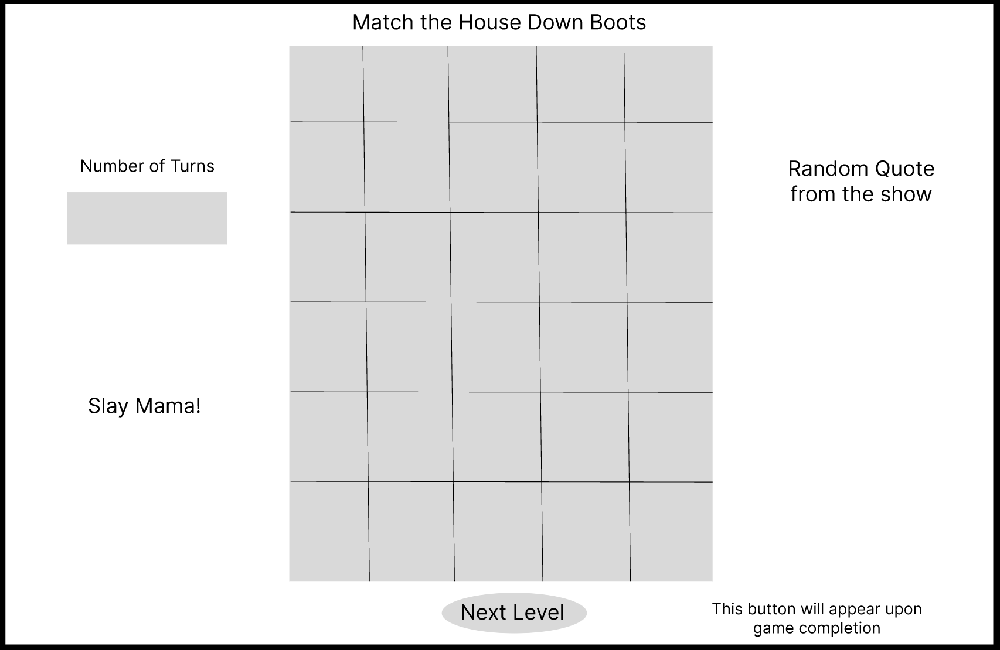

# Matching-Card-Game

# Match The House Down Boots

## Date: 5/12/23

### By: Cody Garcia

[www.codyrgarcia.com](https://www.codyrgarcia.com/)

[@popgoesthecultureshock](https://www.instagram.com/popgoesthecultureshock/)

---

### **_Description_**

In a world where drag is on the forefront of issues to be addressed by certain polititians, outreach and representation matter.
Drag is not evil. While some drag queens are not good... _you know who you are_... They still have the right to be who they are, just like any citizen.
This matching game honors the moving-to-mainstream art form that is drag, and just some of the queens that emerged from the 14 seasons of RuPauls Drag Race. Heard of it?

This is a memory matching card game that users can play to see some of their favorite queens, and compete with each other with their high scores, or low score: since the every turn is tallied. How few turns will it take you to match all the queens?.
Chantay you stay through all 24 cards in less turns than your friends, or sashay away.
Spread the joys drag can create sharing this game with your friends and family!

---

### **_On The Day_**

"It's the day of the show y'all." -Libby Mae Brown

- Opening page of the Werk Room, welcoming the user and containing with links to the three different levels. Or one link to start the game, and the levels happen, one after the other.

- Each game play takes place in the center of the screen, with a move tally on the left, and random words of encouragement from the show on the right.

- Every time you get a match, Alyss Edwards congratulates you with a famous quote from the show: "Backrolls?!" Search through the cards to find all 12 matches in as few turns as you can.

**Quotes randomly cycled**:

-"Don't get bitter, just get better."

-I feel like you’re being sabotaged by your inner saboteur.”

-“It’s okay to fall down. Get up, look sickening, and make them eat it!”

-“I’m not going to panic because I don’t do that anymore. It’s going to be okay.”

-"When the going gets tough, the tough reinvent themselves."

-"She done already done had herses."

-"Well what you wanna do is not necessarily what your gunna do."

-"Your tone seems very pointed right now."

### **_Screenshots_**

### **_Source Photos_**

<!--  -->

- [x] README
- [x] Pseudocode
- [x] Wireframing

**_Credits_**

Images:
[DeviantArt](https://www.deviantart.com/yudelrey/art/Drag-Cards-RuPaul-s-Drag-Race-Season-5-724714112)

[Drag RaceTwitter](https://twitter.com/RuPaulsDragRace/status/1244987814426693632/photo/1)

[Quotes](https://inews.co.uk/culture/television/rupauls-drag-race-best-quotes-catchphrases-jokes-uk-series-345239)

[Markdown Guide](https://ia.net/writer/support/general/markdown-guide)

[Markdown Cheat Sheet](https://www.markdownguide.org/cheat-sheet/)
